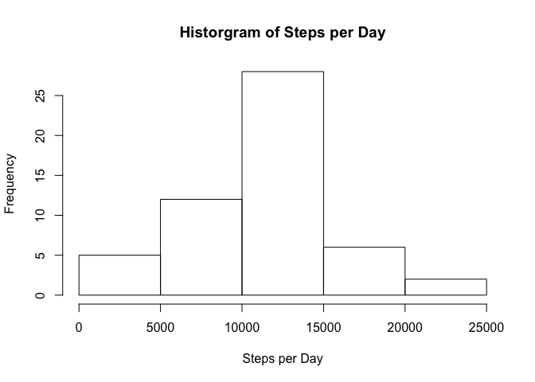
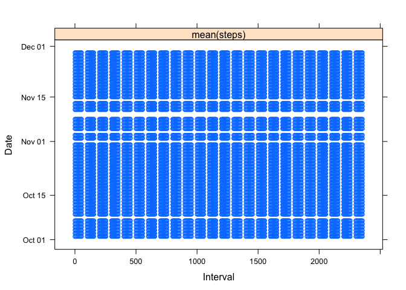

# Reproducible Research: Peer Assessment 1
Alex Wu  
August 6, 2015  


## Loading and preprocessing the data

- set working directory
- load "activity.csv" using read.csv
- view activity object


```r
setwd("~/Google Drive/code/r/reproducible")

# read csv into dataset
activity <- read.csv("activity.csv", header = TRUE, sep = ",", quote = "\"", stringsAsFactors=FALSE)

# remove NA from dataset
activity_no_na <- na.omit(activity)

# View(activity)
# View(activity_no_na)
```


## What is mean total number of steps taken per day?

- Make a histogram of the total number of steps taken each day
    - calculate total number of steps per day
    - plot histogram


```r
steps_per_day_total <- aggregate(steps~date, FUN=sum, data=activity_no_na)
steps_per_day_total
```

```
##          date steps
## 1  2012-10-02   126
## 2  2012-10-03 11352
## 3  2012-10-04 12116
## 4  2012-10-05 13294
## 5  2012-10-06 15420
## 6  2012-10-07 11015
## 7  2012-10-09 12811
## 8  2012-10-10  9900
## 9  2012-10-11 10304
## 10 2012-10-12 17382
## 11 2012-10-13 12426
## 12 2012-10-14 15098
## 13 2012-10-15 10139
## 14 2012-10-16 15084
## 15 2012-10-17 13452
## 16 2012-10-18 10056
## 17 2012-10-19 11829
## 18 2012-10-20 10395
## 19 2012-10-21  8821
## 20 2012-10-22 13460
## 21 2012-10-23  8918
## 22 2012-10-24  8355
## 23 2012-10-25  2492
## 24 2012-10-26  6778
## 25 2012-10-27 10119
## 26 2012-10-28 11458
## 27 2012-10-29  5018
## 28 2012-10-30  9819
## 29 2012-10-31 15414
## 30 2012-11-02 10600
## 31 2012-11-03 10571
## 32 2012-11-05 10439
## 33 2012-11-06  8334
## 34 2012-11-07 12883
## 35 2012-11-08  3219
## 36 2012-11-11 12608
## 37 2012-11-12 10765
## 38 2012-11-13  7336
## 39 2012-11-15    41
## 40 2012-11-16  5441
## 41 2012-11-17 14339
## 42 2012-11-18 15110
## 43 2012-11-19  8841
## 44 2012-11-20  4472
## 45 2012-11-21 12787
## 46 2012-11-22 20427
## 47 2012-11-23 21194
## 48 2012-11-24 14478
## 49 2012-11-25 11834
## 50 2012-11-26 11162
## 51 2012-11-27 13646
## 52 2012-11-28 10183
## 53 2012-11-29  7047
```

```r
hist(steps_per_day_total$steps, xlab="Steps per Day", main="Historgram of Steps per Day")
```

 


- Calculate and report the **mean** and **median** total number of steps taken per day


```r
steps_per_day_total_mean <- mean(steps_per_day_total$steps)
steps_per_day_total_mean
```

```
## [1] 10766.19
```

#### The mean total number of steps taken per day is: 1.0766189\times 10^{4}


```r
steps_per_day_total_median <- median(steps_per_day_total$steps)
steps_per_day_total_median
```

```
## [1] 10765
```

#### The median total number of steps taken per day is: 10765

## What is the average daily activity pattern?

1. Make a time series plot (i.e. `type = "l"`) of the 5-minute interval (x-axis) and the average number of steps taken, averaged across all days (y-axis)


```r
activity_no_na_aggregate <- aggregate(steps~date, FUN=mean, data=activity_no_na)
```


```r
# library(ggplot2) 
# g <- ggplot(activity_no_na_aggregate, aes(x, as.POSIXct(date, format="%Y-%m-%d")))
# g+geom_bar(stat="identity")+labs(title="Average number of steps for a given interval across all days", x="Interval", y="Date")
```


```r
# with(activity_no_na, plot(interval, as.POSIXct(date, format="%Y-%m-%d"), type="n", xlab= "interval", ylab="date"))
# with(activity_no_na_aggregate, lines(date, x))

# plot(activity_no_na$interval, as.POSIXct(activity_no_na$date, format="%Y-%m-%d"), type="l", xlab= "interval", ylab="date", col="green", lwd=2)
# plot(mean(activity_no_na$steps))

library(lattice)
xyplot(as.POSIXct(date, format="%Y-%m-%d") ~ interval | mean(steps), data=activity_no_na, xlab="Interval", ylab="Date")
```

 

2. Which 5-minute interval, on average across all the days in the dataset, contains the maximum number of steps?


```r
# get mean of steps by intervals
activity_no_na_aggregate_interval <- aggregate(steps~interval, FUN=mean, data=activity_no_na)

# sort by descending order on steps to get max steps and corresponding interval
activity_no_na_aggregate_interval_sorted <- activity_no_na_aggregate_interval[order(-activity_no_na_aggregate_interval$steps),]
head(activity_no_na_aggregate_interval_sorted)
```

```
##     interval    steps
## 104      835 206.1698
## 105      840 195.9245
## 107      850 183.3962
## 106      845 179.5660
## 103      830 177.3019
## 101      820 171.1509
```

#### Interval 835 has 206.1698113 steps

## Imputing missing values

Note that there are a number of days/intervals where there are missing values (coded as NA). The presence of missing days may introduce bias into some calculations or summaries of the data.

1. Calculate and report the total number of missing values in the dataset (i.e. the total number of rows with NAs)


```r
# get total rows in dataset
dataset_complete_total_rows <- nrow(activity)

# get total complete rows (rows without NAs) in dataset
dataset_no_na_total_rows <- nrow(activity_no_na)

# take the difference of the number rows of the above two datasets
rows_with_na <- dataset_complete_total_rows - dataset_no_na_total_rows
```

#### The total number of rows with NAs is 2304

2. Devise a strategy for filling in all of the missing values in the dataset. The strategy does not need to be sophisticated. For example, you could use the mean/median for that day, or the mean for that 5-minute interval, etc.


```r
# take a copy of the activity dataset
activity_copy <- activity

# find rows with NA values
show_na_steps <- activity_copy$steps[activity_copy$steps=="NA"]

# recode rows with mean of steps from complete-only dataset
activity_copy$steps[activity_copy$steps=="NA"] <- as.numeric(mean(activity_no_na$steps))
```

3. Create a new dataset that is equal to the original dataset but with the missing data filled in.

4. Make a histogram of the total number of steps taken each day and Calculate and report the mean and median total number of steps taken per day. Do these values differ from the estimates from the first part of the assignment? What is the impact of imputing missing data on the estimates of the total daily number of steps?

## Are there differences in activity patterns between weekdays and weekends?
